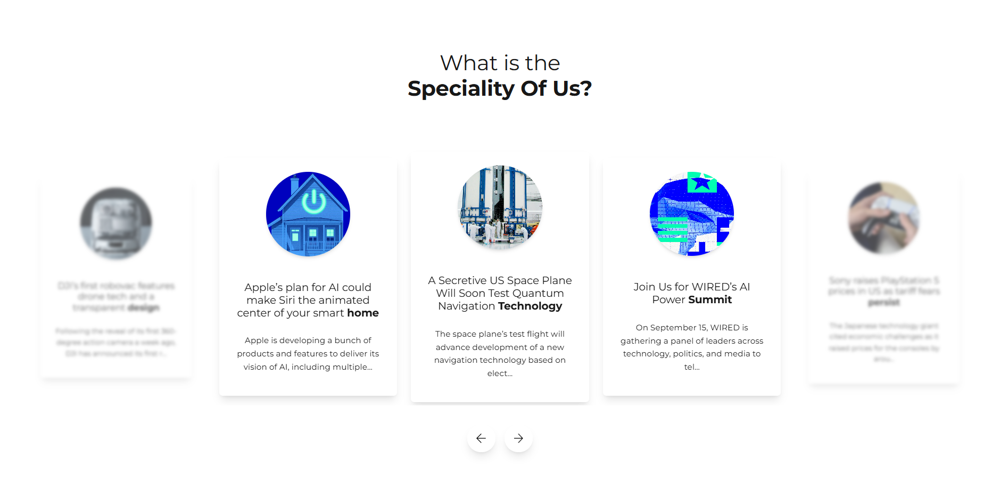
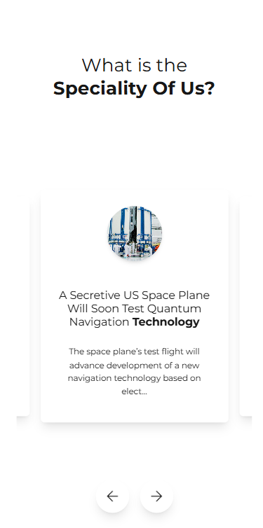

## Descripción del Módulo

Este proyecto implementa un **carousel interactivo de especialidades** construido con Next.js 15, React 19 y Framer Motion. El componente `SpecialtyCarousel` presenta artículos de noticias en un formato de carrusel con efectos visuales avanzados.

### Características Principales

- **Responsive Design**: Adaptación automática entre mobile y desktop
- **Animaciones Fluidas**: Transiciones suaves usando Framer Motion
- **Efectos Visuales**: Blur, escala y opacidad dinámicos para tarjetas no centrales
- **Navegación Intuitiva**: Controles de anterior/siguiente con indicadores visuales
- **Auto-play**: Rotación automática de contenido (opcional)

### Tecnologías Utilizadas

- **Next.js 15.5.2** - Framework React con Turbopack
- **React 19.1.0** - Biblioteca de UI
- **Framer Motion 12.23.12** - Animaciones y transiciones
- **TypeScript 5** - Tipado estático
- **CSS Modules** - Estilos modulares

## Instalación y Ejecución Local

### Prerrequisitos

- Node.js 18+ (recomendado: Node.js 20 LTS)
- npm

### Pasos de Instalación

1. **Clonar el repositorio**

   ```bash
   git clone <repository-url>
   cd frontend-technical-assessment
   ```

2. **Instalar dependencias**

   ```bash
   npm install
   # o
   yarn install
   ```

3. **Configurar variables de entorno** (opcional)

   ```bash
   cp env.example .env.local
   ```

4. **Ejecutar en modo desarrollo**

   ```bash
   npm run dev
   # o
   yarn dev
   ```

5. **Abrir en el navegador**
   ```
   http://localhost:3000
   ```

### Scripts Disponibles

- `npm run dev` - Servidor de desarrollo con Turbopack
- `npm run build` - Construcción para producción
- `npm run start` - Servidor de producción
- `npm run lint` - Verificación de código con ESLint

## Capturas del Resultado Final

### Vista Desktop



### Vista Mobile



## Estructura del Proyecto

```
src/
├── components/
│   └── SpecialityCarousel/
│       ├── SpecialityCarousel.tsx    # Componente principal
│       ├── styles.module.css         # Estilos modulares
│       ├── actions.ts                # Acciones del carousel
│       └── types/                    # Definiciones TypeScript
├── app/                              # Páginas Next.js
└── ...
```

## Características Técnicas

- **Responsive Breakpoints**: 1024px para cambio entre mobile/desktop
- **Performance**: Optimizado con Turbopack y lazy loading
- **Accessibility**: Navegación por teclado y ARIA labels
- **SEO**: Meta tags y estructura semántica
